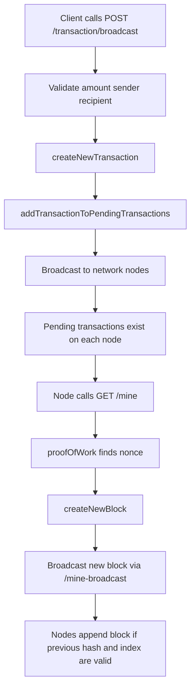
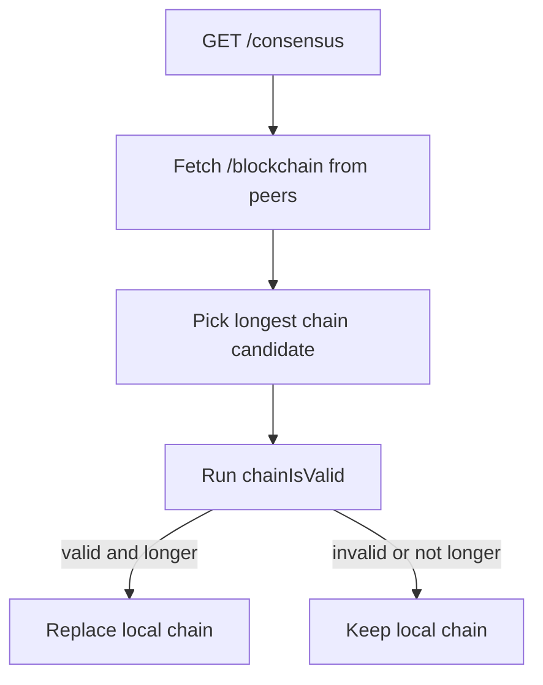

# Blockchain Learning Handbook

This handbook is designed to help learners understand both blockchain theory and this specific project implementation.

## 1. Why Blockchain Exists

Traditional systems rely on trusted intermediaries (banks, registries, clearing houses). Blockchain introduced a way to coordinate value transfer and state changes across untrusted participants without a central authority.

Core problem solved:
- How to prevent double spending in a distributed system without a central database owner.

## 2. Short History

- 1979 to 1997: Merkle trees, digital signatures, and proof systems established cryptographic foundations.
- 2008: Bitcoin whitepaper published by Satoshi Nakamoto.
- 2009: Bitcoin mainnet launched, proving decentralized consensus in production.
- 2015: Ethereum generalized the model with programmable smart contracts.
- 2020 onward: Enterprise and public chains expanded into identity, supply chain, tokenization, and settlement.

## 3. Concepts Most People Miss

- Immutability is economic, not magical: history can be rewritten if an attacker controls enough resources.
- Finality is probabilistic in PoW systems: confidence increases with confirmations.
- Throughput, decentralization, and security trade off against each other (blockchain trilemma).
- Public chains optimize for censorship resistance, not raw speed.
- Most attacks target wallets, keys, bridges, and app layers, not the base chain cryptography.

## 4. Architecture in This Repository

Main files:
- Core ledger logic: [dev/blockchain.js](dev/blockchain.js)
- API and network endpoints: [dev/api.js](dev/api.js)
- Security middleware: [dev/security.js](dev/security.js)
- Core tests: [dev/blockchain.test.js](dev/blockchain.test.js)
- API tests: [dev/api.test.js](dev/api.test.js)

### 4.1 Core Function Map

Functions in [dev/blockchain.js](dev/blockchain.js):
- createNewBlock: creates and appends a block.
- getLastBlock: returns chain tip.
- createNewTransaction: creates transaction object.
- addTransactionToPendingTransactions: queues transaction for next block.
- hashBlock: computes SHA-256 over previous hash + nonce + data.
- proofOfWork: finds nonce so hash starts with 0000.
- chainIsValid: verifies hash links, PoW rule, and genesis invariants.
- getBlock: block lookup by hash.
- getTransaction: transaction lookup by id.
- getAddressData: collects transactions and calculates address balance.

Endpoints in [dev/api.js](dev/api.js):
- /transaction, /transaction/broadcast, /mine, /consensus
- /register-node flows for peer network formation
- /block, /transaction, /address lookup routes

Security controls in [dev/security.js](dev/security.js):
- Helmet headers
- Global/write/mining rate limits
- Input validation for request bodies and params
- Optional API key authentication

## 5. End-to-End Transaction Flow

## 6. Consensus Flow in This Project

## 7. What Changed for Production-Style Learning

Hardening implemented in [dev/api.js](dev/api.js) and [dev/security.js](dev/security.js):
- Input validation on write and lookup routes
- Rate limiting for all requests, with stricter mining limits
- Helmet security headers
- Optional API-key auth controlled by environment variables
- Centralized 404 and error handlers

Environment variables:
- REQUIRE_API_KEY=true or false
- API_KEY=your-secret-key

If REQUIRE_API_KEY=true, all API routes except block explorer require header x-api-key.

## 8. Real-World Use Cases (Beyond Hype)

High-value practical areas:
- Cross-border settlement where intermediaries add delays and cost.
- Asset tokenization (bonds, funds, invoices) with programmable transfer rules.
- Supply chain traceability where multiple organizations need shared state.
- Machine identity and integrity logs (IoT firmware attestations).
- Verifiable credentials and selective disclosure identity systems.

Underused but promising:
- Public procurement transparency.
- Environmental credit accounting with auditable issuance and retirement.
- Shared scientific data integrity trails.

## 9. Industry Concepts You Should Know

- UTXO vs account model.
- L1 vs L2 (rollups, channels).
- MEV (miner/maximal extractable value).
- Bridges and interoperability trust assumptions.
- On-chain governance vs off-chain governance.
- Finality types: probabilistic, economic, deterministic.
- Data availability and execution separation.
- Oracle trust model and oracle manipulation risk.

## 10. Security and Threat Model Basics

Common failure points:
- Weak key management and secret handling.
- Smart contract logic bugs (reentrancy, access control, integer handling).
- Bridge validator compromise.
- Centralized upgrade/admin keys.
- Poor API controls around off-chain components.

This project now demonstrates:
- Validation at API boundaries.
- Rate limiting for abuse resistance.
- Optional authentication model for private deployments.

## 11. Performance and Scaling Reality

PoW demo chains are intentionally simple. Production systems must address:
- Throughput bottlenecks.
- State growth and archival costs.
- Mempool policy and spam resistance.
- Fee market behavior under demand spikes.

Scaling families:
- Bigger blocks and faster blocks (L1 tuning).
- Off-chain execution with L1 settlement (L2 rollups).
- Sharding and modular architectures.

## 12. Suggested Learning Path Through This Codebase

1. Read createNewBlock, hashBlock, proofOfWork in [dev/blockchain.js](dev/blockchain.js).
2. Run tests in [dev/blockchain.test.js](dev/blockchain.test.js) and inspect assertions.
3. Trace /mine and /consensus in [dev/api.js](dev/api.js).
4. Inspect validation and auth middleware in [dev/security.js](dev/security.js).
5. Open block explorer and map UI actions to endpoints.

## 13. Future of Blockchain (Practical View)

Likely growth:
- Tokenized real-world assets with regulated rails.
- Programmable settlement in capital markets.
- Zero-knowledge proof integrations for privacy-preserving compliance.
- Decentralized identity as verifiable credentials standards mature.

Likely constraints:
- Regulatory fragmentation.
- UX and key management friction.
- Interoperability and bridge risk.
- Concentration pressures in infrastructure providers.

## 14. Appendix A: Mapping Features to Functions

- Mining pipeline:
  - proofOfWork, hashBlock, createNewBlock in [dev/blockchain.js](dev/blockchain.js)
  - /mine and /mine-broadcast in [dev/api.js](dev/api.js)
- Consensus:
  - chainIsValid in [dev/blockchain.js](dev/blockchain.js)
  - /consensus in [dev/api.js](dev/api.js)
- Transaction lifecycle:
  - createNewTransaction, addTransactionToPendingTransactions in [dev/blockchain.js](dev/blockchain.js)
  - /transaction and /transaction/broadcast in [dev/api.js](dev/api.js)
- Security controls:
  - middleware and validators in [dev/security.js](dev/security.js)

## 15. Appendix B: Key Facts Quick Sheet

- Bitcoin target block time is ~10 minutes.
- Proof-of-work finality is probabilistic.
- A longer chain is accepted only if it is also valid.
- In this demo, PoW difficulty is fixed by prefix rule 0000.
- Genesis block invariants are explicit in chainIsValid.

## 16. Appendix C: References and Citations

Primary references used to build this handbook:
- Bitcoin Whitepaper: https://bitcoin.org/bitcoin.pdf
- Ethereum Whitepaper: https://ethereum.org/en/whitepaper/
- NIST SHA-256 standard (FIPS 180-4): https://csrc.nist.gov/publications/detail/fips/180/4/final
- Merkle tree concept (R. Merkle 1987): https://people.eecs.berkeley.edu/~raluca/cs261-f15/readings/merkle.pdf
- Chainlink oracle security overview: https://docs.chain.link/resources/security
- BIS and IMF papers on tokenization and cross-border payments:
  - https://www.bis.org/publ/othp56.htm
  - https://www.imf.org/en/Publications/fintech-notes
- OWASP API Security Top 10: https://owasp.org/API-Security/
- Ethereum rollup-centric roadmap notes:
  - https://ethereum.org/en/roadmap/scaling/

Note: This repository is a teaching implementation, not a production blockchain client.
